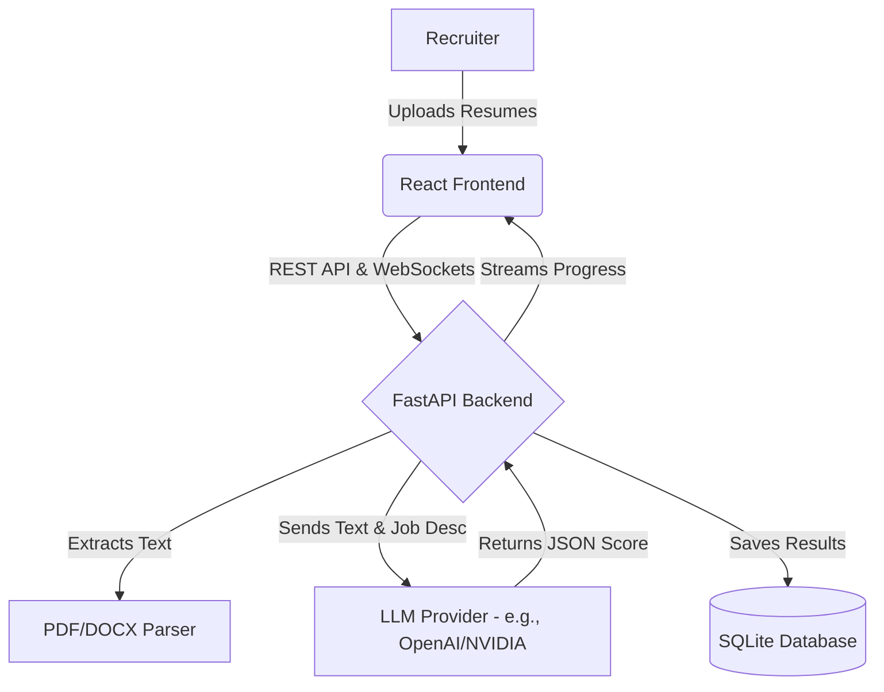

# ResuMate ATS

<p align="center">
  <em>An open-source, AI-powered Applicant Tracking System (ATS) that automates resume screening and candidate ranking.</em>
</p>

---

## 🚀 Overview

ResuMate ATS is a full-stack web application designed to help recruiters and hiring managers instantly process, analyze, and rank hundreds of resumes against a specific job description. 

Instead of simple keyword matching, ResuMate utilizes large language models (LLMs) to deeply understand candidate experience, extract skills, and provide a comprehensive "Match Score" with tailored feedback.

### Key Features
- **Bulk Upload & Processing:** Upload up to 500 PDF/DOCX/TXT resumes at once.
- **AI-Powered Analysis:** Leverages LLMs to evaluate context, not just keywords.
- **Real-Time WebSockets:** Watch the AI process candidates live with a beautiful progress UI.
- **Data Export:** Export all ranked candidates to CSV for your records.
- **Full-Stack Dockerized:** Runs flawlessly anywhere with a single Docker command.

---

## 🏗️ Architecture

The platform is divided into a sleek React frontend and a robust FastAPI backend.



### Tech Stack
- **Frontend:** React, Vite, TailwindCSS (Vanilla UI concepts)
- **Backend:** Python 3.11, FastAPI, Uvicorn, SQLAlchemy
- **Database:** SQLite (local persistent storage)
- **Containerization:** Docker (Multi-stage build)

---

## 🛠️ Local Setup & Deployment

### 1. Generating Test Data
To test the system, you can automatically generate 10 realistic resumes ranging from perfect matches to completely irrelevant candidates.
```bash
python scripts/generate_resumes.py
```
*This will create a `test_data/resumes/` folder populated with test files.*

### 2. Environment Variables
Create a `.env` file in the root directory and add the following keys. You must provide a secure encryption key to safely store your AI API keys in the local database.
```env
# Generate a secure key using: python -c "from cryptography.fernet import Fernet; print(Fernet.generate_key().decode())"
ENCRYPTION_KEY="your-secure-encryption-key-here"
```

### 3. Running with Docker (Recommended)
The entire application is bundled into a multi-stage Docker image, meaning you don't need to install Node.js or Python on your local machine.

**Build the image:**
```bash
docker build -t resumate-app .
```

**Run the container:**
```bash
docker run --env-file .env -p 8000:8000 resumate-app
```

**Access the App:**
Open your browser and navigate to: `http://localhost:8000`

---

## 🤝 Contributing
Contributions are welcome! If you'd like to add a Candidate Portal, improve the AI prompts, or enhance the UI, please feel free to fork the repository and submit a Pull Request.

## 📄 License
This project is open-source and available under the [MIT License](LICENSE).
