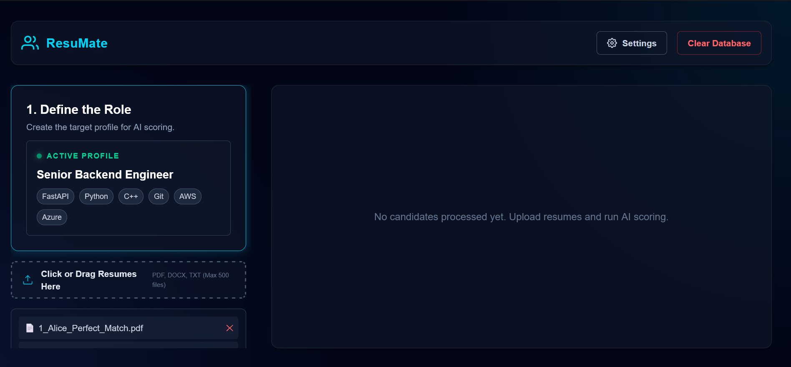
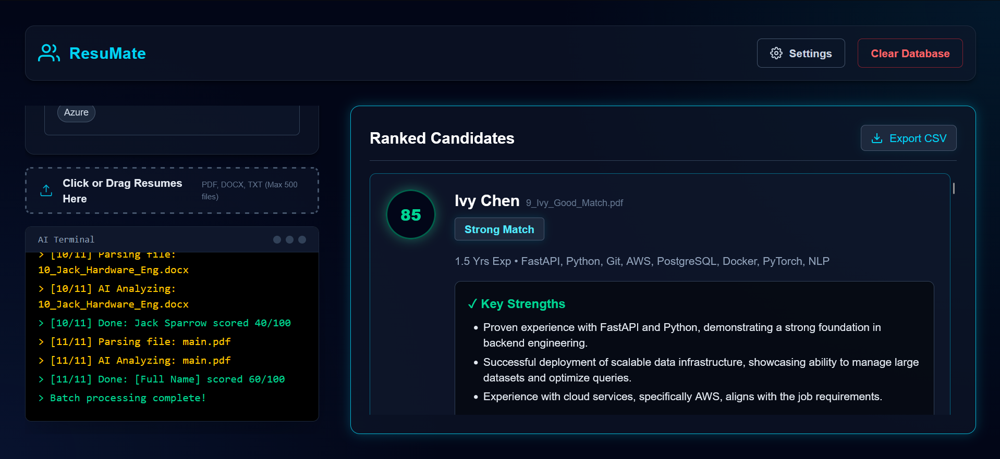
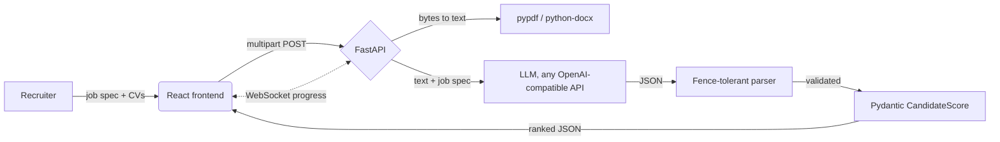

# ResuMate ATS

**An AI-powered applicant tracking system.** Give it a job description and a
batch of CVs; it reads each one, scores it against the role, and returns a
ranked shortlist with reasoning.

[](https://github.com/StanLeyM07/resumate-ats/actions/workflows/ci.yml)


[](LICENSE)

> **Status: finished side project, not actively developed.** It runs from a
> single `docker build`. There is no hosted demo, because scoring calls a paid
> LLM API and an open endpoint would be somebody else's bill. The screenshots
> below are the real UI. For a deployed app you can click, see
> **[Sifa](https://sifa-beryl.vercel.app)**.



*Step one: define the role. Skills become the scoring target, and CVs queue up
underneath. PDF, DOCX and TXT, up to 500 per batch.*



*Output: a ranked shortlist. Each candidate carries a score, a verdict, the
extracted skills, and the model's reasoning for and against. The left panel
streams progress over a WebSocket as each CV is parsed and scored. Results
export to CSV.*

---

## How it works



**The backend is stateless.** There is no database and nothing is written to
disk. A batch is parsed, scored and returned in the response, then forgotten.
That is a deliberate choice for a tool that handles other people's personal
data: CVs contain names, addresses and phone numbers, and the safest place to
put them is nowhere.

### Tech

| Layer | Choice |
|---|---|
| Backend | Python 3.11+, FastAPI, Uvicorn, Pydantic v2 |
| Extraction | `pypdf` (digital PDFs), `python-docx` (paragraphs **and** tables) |
| Model | Any OpenAI-compatible endpoint. Defaults to NVIDIA NIM `llama-3.1-70b-instruct`; OpenAI, Groq, OpenRouter and Ollama work by changing the base URL |
| Frontend | React, Vite, live progress over WebSocket |
| Packaging | Multi-stage Docker: Node builds the frontend, the final image is Python only |

---

## The parts worth reviewing

**`backend/scorer.py` — making a model's output safe to parse.**
The system prompt says "return only valid JSON". Models comply most of the
time, which is the problem. `parse_model_json()` is a pure function that
handles the failure modes: ` ```json ` fences, uppercase ` ```JSON `, bare
fences, prose wrapped around the block, truncated output with no closing
fence, and `None` content. It is separated from the API call precisely so it
can be tested without a key or a network — **that separation is the point**,
and `tests/test_scorer.py` covers all of it. Output is then validated through
a Pydantic `CandidateScore`, so a well-formed response with the wrong shape
still fails loudly rather than reaching the UI.

**`backend/file_parser.py` — extraction that does not silently lose content.**
DOCX table cells are extracted as well as paragraphs, because plenty of CVs
put the skills matrix in a table and dropping it loses the most scoreable
content on the page. Decoding uses `errors="replace"`, so one bad byte
degrades a single CV instead of failing the whole batch.

**`backend/main.py` — not blocking the event loop.**
The OpenAI SDK's `create()` is synchronous. Called directly it would block
FastAPI's event loop and serialise the entire batch. It runs inside
`asyncio.to_thread()`, which keeps the server responsive and lets WebSocket
progress actually stream while scoring is in flight.

### Known limitations

Stated rather than hidden, because they are the first things a reviewer will
find:

- **No OCR.** `pypdf` reads digital PDFs. A scanned or photographed CV
  extracts nothing and is rejected with a clear error rather than scored on
  empty text.
- **The score is a model judgement, not a measurement.** Two runs can differ.
  `temperature=0.2` reduces it; it does not eliminate it. This is a screening
  aid, not a decision.
- **Candidate names come from the model** and can come back as placeholder
  text when a CV has an unusual header layout.
- **CORS is pinned to localhost.** Deploying anywhere real means setting real
  origins in `backend/main.py`.

---

## Running it

### Docker (recommended)

```bash
docker build -t resumate-app .
docker run -p 8000:8000 resumate-app
```

Open <http://localhost:8000>. No Node or Python needed on the host.

The AI provider is configured **in the UI**, under Settings: base URL, model
name and API key. Nothing needs to be baked into the image. If you would
rather supply a server-side fallback key, set `NVIDIA_API_KEY` in the
environment and it is used whenever the UI has no key:

```bash
docker run -e NVIDIA_API_KEY=your-key -p 8000:8000 resumate-app
```

### Local development

```bash
pip install -r requirements-dev.txt
uvicorn backend.main:app --reload          # API on :8000

cd frontend && npm install && npm run dev  # UI on :5173
```

### Tests

```bash
pytest tests/ -q      # 19 tests
```

No network and no API key required: every test runs against in-memory bytes
and fixed strings. CI runs them on Python 3.11 and 3.12 on every push.

### Test data

Ten synthetic CVs, from a perfect match to an irrelevant one:

```bash
python scripts/generate_resumes.py     # writes test_data/resumes/
```

---

## License

MIT. See [LICENSE](LICENSE).
